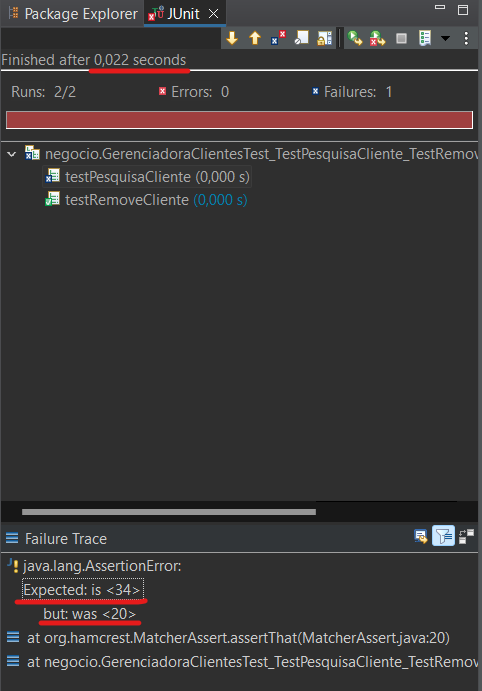

## Relatório de Teste de Qualidade - Funções TestPesquisaCliente e TestRemoveCliente do Sistema Bancario

**Data:** 24/05/2024

**Autor:** Jhoey Monks

**Objetivo:** Verificar o funcionamento das funções de pesquisa e remoção de clientes no Sistema Bancario utilizando testes unitários com JUnit.

**Testes Realizados:**

* **TestPesquisaCliente:** Verificação se a função retorna o cliente correto com base no ID informado e se a idade do cliente é validada corretamente durante a pesquisa.
* **TestRemoveCliente:** Verificação se a função remove o cliente correto da lista e se a lista é atualizada adequadamente.

**Resultados:**

* **TestPesquisaCliente:** O teste foi parcialmente aprovado. A função retornou o cliente correto, mas a validação da idade falhou.
* 
* **TestRemoveCliente:** O teste foi executado com sucesso. A função removeu o cliente corretamente e a lista foi atualizada com sucesso.

**Detalhes Adicionais:**

* Os testes foram realizados utilizando o Eclipse IDE com as bibliotecas JUnit 4.12 e Hamcrest 1.3.
* Os arquivos do sistema bancário e bibliotecas necessárias estão disponíveis neste repositório.

**Para mais detalhes sobre os testes, consulte o arquivo "RelatorioTestes.html" disponível neste repositório.**

**Links Úteis:**

* [Download da última versão do Eclipse IDE](https://www.eclipse.org/downloads/packages/)
* [Download da biblioteca JUnit 4.12](https://repo1.maven.org/maven2/junit/junit/4.12/junit-4.12.jar)
* [Download da biblioteca Hamcrest 1.3](https://repo1.maven.org/maven2/org/hamcrest/hamcrest-core/1.3/hamcrest-core-1.3.jar)
* Os Arquivos JUnit e Hamcrest também estão disponíveis para download direto no repositório

**Observação:**

O código fonte dos testes e do sistema bancário estão disponíveis neste repositório.
